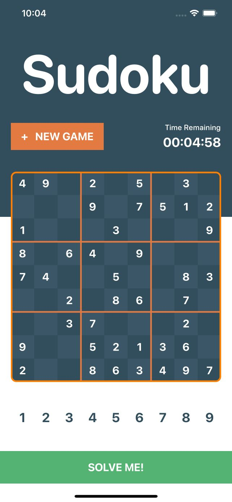
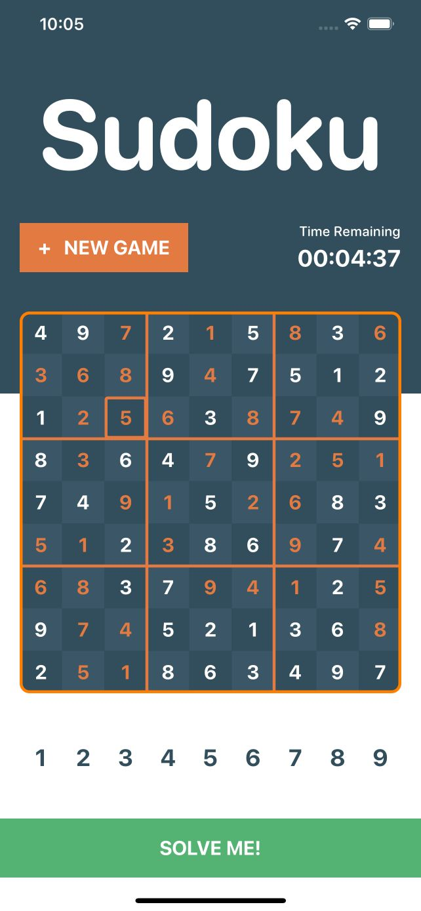
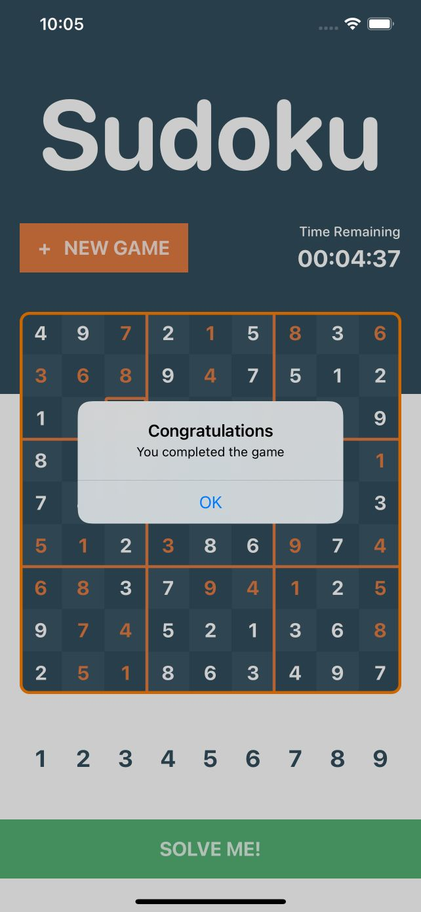
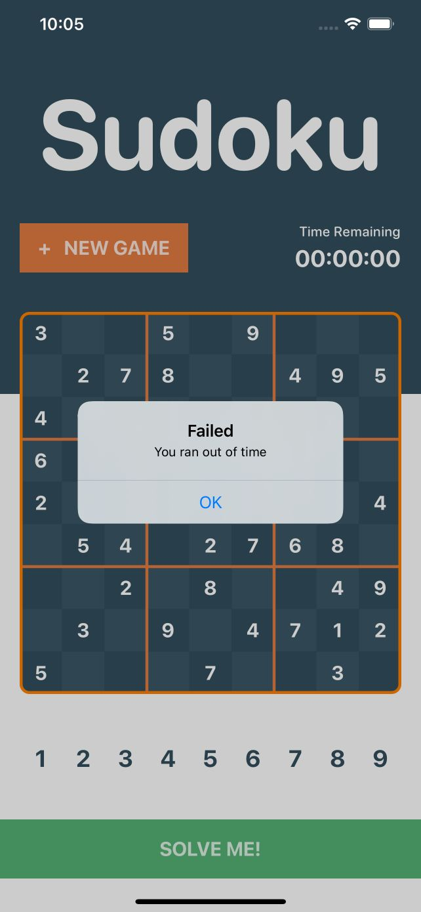

## **Simple Sudoku**

Simple Sudoku game built using:
 - **Xcode** 12.4 (12D4e)
 - **Swift** 5
 - **UIKit** (using XIB)
 - **RxSwift**
 - [**PBSudoku**](https://github.com/sainkr/PBSudoku)

**Screenshots:**

    
    
